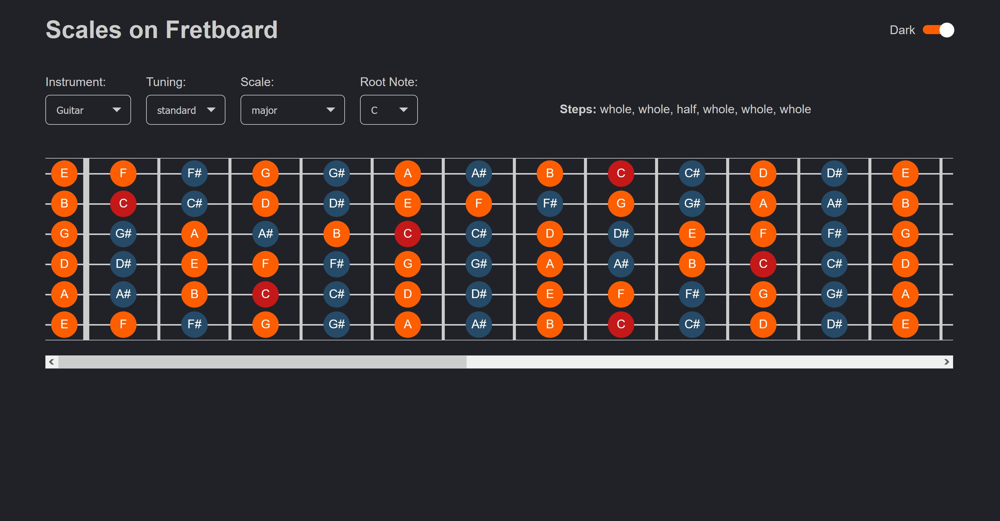

# scales-on-fretboard

Scales on fretboard is a Vue app which helps to see the scales on a fretboard.



Options available:

- choose an instrument among guitar (6-7 strings), bass (4-5-6 strings), ukulele
- choose a tuning (different possibilities by instruments)
- choose scale to display (common scales and modes)
- choose the root note of the scale
- light and dark theme

## Project setup
```
npm install
```

### Compiles and hot-reloads for development
```
npm run serve
```

### Compiles and minifies for production
```
npm run build
```

### Lints and fixes files
```
npm run lint
```

### Customize configuration
See [Configuration Reference](https://cli.vuejs.org/config/).

## Changelog
* **V2.0.0** 2021-02-14: Get rid of React and recreate the project from scratch in Vue
* **V1.0.0** 2019-04-21: Initial release wih React
